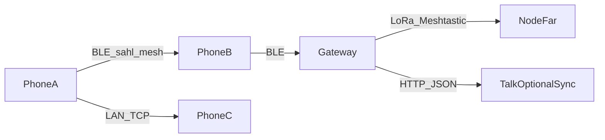

# Offline mesh → LoRa / Meshtastic bridge (Phase 4 architecture)

**Status:** LoRa = firmware scaffold (no Talk SDK yet). Phone RF = BLE + same-Wi‑Fi + Direct.  
**Phone-dependent path (primary product):** BLE + LAN + Wi‑Fi Direct/MPC — **no external hardware**.  
**Wave 1 (shipped):** `sahl_mesh` BLE gossip + Bonsoir/TCP + Offline LAN **Direct** (`nearby_service`).  
**Donor patterns:** Maps `RfBridgeDriver` / `DEVICE_FRAMEWORK.md` (HTTP bridge to 433/868/915 radios).

## Goal

**Cellphone-dependent communication** = direct phone↔phone with **no LoRa bridge required**. Path: **BLE + same-Wi‑Fi LAN + Direct (Wi‑Fi Direct / MPC)**.

Phones never speak LoRa directly. Optional **external LoRa nodes** remain opt-in long-range (see `firmware/lora_ble_bridge/`). Do **not** rewrite `sahl_mesh` gossip as GATT mesh.

## RF taxonomy (avoid conflating “RF” with LoRa)

| Path | Radio | Band | Typical range | Hardware | Talk status |
|------|-------|------|---------------|----------|-------------|
| **Phone RF — BLE** | Bluetooth LE | 2.4 GHz ISM | ~10–100 m | Built into phone | **Live:** `sahl_mesh` gossip |
| **Phone RF — Wi‑Fi** | WLAN / same AP | 2.4 / 5 GHz | room–building (AP) | Built into phone | **Live:** Bonsoir + TCP |
| **Phone RF — Direct** | Wi‑Fi Direct (Android) / MPC (iOS) | 2.4 / 5 GHz (+ BT fallback on Darwin) | ~10–100 m, **no router** | Built into phone | **Live v1:** Offline LAN → **Direct** (`nearby_service` / `p2p_service.dart`) |
| **Long-range RF — LoRa** | LoRa / Meshtastic | sub‑GHz (e.g. 915 MHz PK) | ~1–10 km | **External** node/bridge | **Live attach:** Me → LoRa bridge (`lora_bridge_service.dart`) + `firmware/lora_ble_bridge/` |

**Facts locked in:**

1. BLE and Wi‑Fi **are** RF — they are **not** “non-RF.” They are also **not** LoRa-class long-range RF.
2. **No phone ships a LoRa radio.** Kilometer offline RF always means a **two-hop bridge** (phone ↔ BLE/Wi‑Fi ↔ LoRa node).
3. **v1 product RF** = phone-native BLE + same-Wi‑Fi LAN + **Direct (Wi‑Fi Direct / MPC)**. Same-OS P2P only for Direct (plugin limit).
4. **LoRa** = optional hardware path. DIY firmware + Talk BLE attach (GATT Nordic UART–style UUIDs) are in-repo. Phone-only chat does not require a bridge.

## Hardware BOM (DIY)

| Component | Typical cost | Role |
|-----------|--------------|------|
| RA-02 / SX1262 module | $20–25 | LoRa radio (868/915 MHz regional) |
| ESP32 + LoRa board | $15–20 | DIY node / USB serial to gateway |
| Meshtastic T-Echo / T-Beam | $35–50 | Prebuilt node, Meshtastic firmware |
| RPi + LoRa HAT / concentrator | $50–250 | Site gateway (optional TTN later) |

## Protocol choice

| Stack | Use in INTERACT |
|-------|-----------------|
| **sahl_mesh (BLE)** | Primary phone↔phone offline text (in Talk today) |
| **Bonsoir + TCP** | Same-Wi‑Fi text without BLE |
| **Meshtastic** | External long-range nodes; gateway translates to sahl_mesh frames or Talk outbox |
| Reticulum / Columba | Evaluated; not adopted until BLE+LAN prove product value |
| Bridgefy / ham | Avoided (proprietary / license) |

## Gateway contract (future)

1. USB/BLE attach to a Meshtastic device (or serial ESP32).
2. Map short Talk payloads (`talk:…` hello frames) ↔ Meshtastic text packets (UTF-8, size-capped).
3. Optional HTTP push to `qurbanisahulat` only when uplink exists (reuse Talk outbox).
4. Never invent a second chat backend — cloud sync remains `/api/v1/talk/*` / chat threads.

## Threat model (offline mesh)

| Threat | Mitigation |
|--------|------------|
| Replay | msgId bloom + short TTL (sahl_mesh already) |
| Spoofed author | Ed25519 signatures on high-stakes kinds; Talk chat over hello is best-effort until signed chat kind |
| Sybil flood | Rate-limit advertise duty cycle; ignore oversized chunks |
| MITM on LoRa | AES/channel keys on Meshtastic; don’t put secrets in clear hello payloads |
| Location leak via BLE | Android `neverForLocation` scan flag; no GPS in mesh frames |

## Power

- BLE: duty-cycled advertise (sahl_mesh `BleTransportConfig`).
- LoRa: ADR / sparse packets; gateway stays powered; phones sleep radios when Offline LAN/mesh screens closed.

## Rollout

1. ~~BLE + LAN in Talk~~ (Wave 1)
2. Field-test 2-phone BLE text
3. Prototype USB Meshtastic gateway (separate repo/script under `interact-maps` RF-bridge pattern)
4. Only then path-dep a Meshtastic client library if still needed

## Non-goals

- Opus voice over LoRa
- Phone as LoRaWAN end-device
- Zigbee/Z-Wave smart-home cloud lock-in inside Talk

## Decision log (2026-07-26)

**Decision:** LoRa / Meshtastic stays **doc-only** until BLE + LAN field-prove phone↔phone text. No Meshtastic/Reticulum SDK in Talk until Wave-1 transports earn it.

**Why this sequencing holds**

| Layer | Flutter reality | Talk choice |
|-------|-----------------|-------------|
| BLE | `flutter_reactive_ble` (BSD-3, Android/iOS) vs `flutter_blue_plus` (broader platforms; **paid commercial license** for for-profit) | Stay on path-dep **`sahl_mesh`** BLE gossip; do **not** adopt `flutter_blue_plus` for commercial Talk without a license review |
| LAN | `nsd` (mDNS/DNS-SD) + `dart:io` TCP/UDP (or LAN MQTT) | Already shipped: **Bonsoir** discovery + **TCP** text (`lan_service.dart`) — same pattern, no second discovery stack |
| LoRa | Phones have **no** native LoRa radio; always needs an external bridge (ESP32 / RAK / Meshtastic) over BLE or Wi‑Fi/MQTT | Confirms two-hop architecture above; LoRa rides on BLE/LAN bridge patterns, it does not replace them |

**Gate to reopen LoRa implementation:** reliable 2-phone BLE text + same-Wi‑Fi LAN text in the field (Rollout steps 2→3). Until then, treat this file as the ADR.

## Wave-1 validation tracker (2026-07-26)

**Do not** reimplement BLE/LAN (`flutter_reactive_ble` / `nsd` greenfield). Harden and field-test what ships today.

### Field tests (Pakistan team phones — Android first)

| Transport | Scenario | Success criteria | Result |
|-----------|----------|------------------|--------|
| BLE | 2 phones, ~10 m | Deliver &lt;2 s, no drops | ☐ |
| BLE | 2 phones, ~50 m open | Deliver &lt;5 s, &lt;1% loss | ☐ |
| LAN | 2 phones, same Wi‑Fi, no cellular | Deliver &lt;1 s | ☐ |
| LAN | 3+ phones, same Wi‑Fi | All receive; no duplicate UX spam | ☐ |

UI entry points: **Me → Nearby mesh** (`sahl_mesh`), **Me → Offline LAN** (Bonsoir + TCP).

Harden only what fails: runtime BLE perms, background/foreground service, chunking/MTU via `sahl_mesh` `MeshChunker`, reconnect, Bonsoir resolve (no hardcoded IPs).

### `flutter_blue_plus` license (commercial)

**Resolved (OSS-first):** Talk + `sahl_mesh` use **`flutter_reactive_ble` (BSD-3)** for scan/GATT; advertise stays on `flutter_ble_peripheral`. FBP removed — do **not** buy unless migrate regresses (official portal only: [jamcorder](https://jamcorder.myshopify.com/products/flutterblueplus-commercial-license)). See [`COMMERCIAL_DEPS_AND_RF_PK.md`](./COMMERCIAL_DEPS_AND_RF_PK.md).

| Option | Action | Status |
|--------|--------|--------|
| Buy org license | Match employee-count tier; keep FBP | ☐ Decide |
| Migrate | Swap **scan/central** side inside **`sahl_mesh` repo** (`BleTransport`) to `flutter_reactive_ble`; keep `flutter_ble_peripheral` for advertise. **Not** a GATT connect/write mesh rewrite. Branch in `sahl_mesh`, not `interact-app`. Talk UI unchanged. | ☐ If no buy |
| Audit note | Outcome + chosen path | ☐ |

**Architecture note:** Wave-1 BLE is **adv/scan gossip** (manufacturerData chunks + `MeshChunker`), not classic GATT sessions. Generic “connect → discoverServices → writeCharacteristic” migration samples do **not** apply. Chunking, duty-cycle advertise, and Bonsoir LAN already exist — harden failures from field tests only.

**Sequencing (locked):** (1) license decide buy vs migrate → (2) Android field-test BLE/LAN → (3) harden only what fails → (4) migrate scan layer if buy refused → (5) LoRa bridge only if/when product wants beyond-phone range. Do **not** schedule LoRa in parallel with (1)–(3).

### Phone-only scope (what not to build)

| Proposal often seen in generic plans | Talk reality |
|--------------------------------------|--------------|
| New GATT connect/write “BLE mesh” on `flutter_reactive_ble` | **Reject.** Mesh is already **adv/scan gossip** + TTL/Bloom in `sahl_mesh` |
| Reimplement Bonsoir + TCP / new `MeshMessage` JSON | **Reject.** `lan_service.dart` + Nearby mesh UI already ship |
| Wi‑Fi Direct / iOS Multipeer | **In v1** via Offline LAN → **Direct** (`p2p_service.dart`). Same-OS only; Android↔iOS use Same Wi‑Fi mode |
| “BLE has no multi-hop” | **Wrong for Talk.** `sahl_mesh` rebroadcasts with TTL + dedup; field-test that, don’t reinvent |
| “Skip LoRa forever” | **Skip for phone-only product.** Keep this file as opt-in long-range ADR; no hardware purchase until that product choice |

### LoRa hardware

**Do not** start bridge firmware until field tests pass. Optional early order (lead time only): Meshtastic T-Echo/T-Beam **or** DIY ESP32 + RA-02 — decision recorded here when purchased.

| Item | Choice | Status |
|------|--------|--------|
| Hardware | ☐ T-Echo/T-Beam · ☐ ESP32+RA-02 · ☐ deferred | ☐ |
| Firmware scaffold | `firmware/lora_ble_bridge/` (Arduino + README) | ✅ |
| Talk BLE attach to bridge | Me → **LoRa bridge** / `/lora-bridge` | ✅ |
