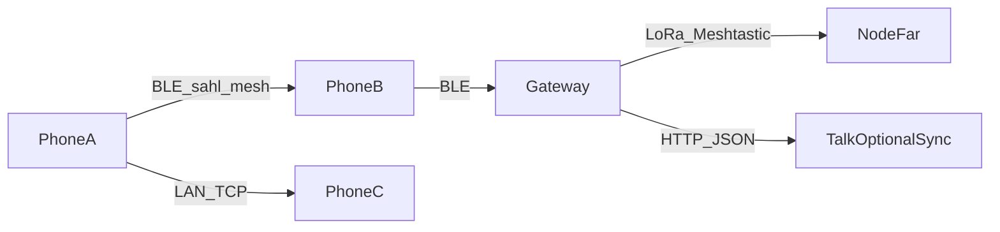

# Offline mesh → LoRa / Meshtastic bridge (Phase 4 architecture)

**Status:** Design only — no Meshtastic/Reticulum/Columba SDK in Talk yet.  
**Wave 1 (shipped in app):** Bonsoir LAN TCP text + `sahl_mesh` BLE gossip.  
**Donor patterns:** Maps `RfBridgeDriver` / `DEVICE_FRAMEWORK.md` (HTTP bridge to 433/868/915 radios).

## Goal

Phones never speak LoRa directly. Talk stays on **BLE + Wi‑Fi LAN**; optional **external LoRa nodes** (Meshtastic T-Echo / T-Beam / ESP32+RA-02) bridge into the same gossip namespace via a small gateway process.

## Hardware BOM (DIY)

| Component | Typical cost | Role |
|-----------|--------------|------|
| RA-02 / SX1262 module | $20–25 | LoRa radio (868/915 MHz regional) |
| ESP32 + LoRa board | $15–20 | DIY node / USB serial to gateway |
| Meshtastic T-Echo / T-Beam | $35–50 | Prebuilt node, Meshtastic firmware |
| RPi + LoRa HAT / concentrator | $50–250 | Site gateway (optional TTN later) |

## Protocol choice

| Stack | Use in INTERACT |
|-------|-----------------|
| **sahl_mesh (BLE)** | Primary phone↔phone offline text (in Talk today) |
| **Bonsoir + TCP** | Same-Wi‑Fi text without BLE |
| **Meshtastic** | External long-range nodes; gateway translates to sahl_mesh frames or Talk outbox |
| Reticulum / Columba | Evaluated; not adopted until BLE+LAN prove product value |
| Bridgefy / ham | Avoided (proprietary / license) |

## Gateway contract (future)

1. USB/BLE attach to a Meshtastic device (or serial ESP32).
2. Map short Talk payloads (`talk:…` hello frames) ↔ Meshtastic text packets (UTF-8, size-capped).
3. Optional HTTP push to `qurbanisahulat` only when uplink exists (reuse Talk outbox).
4. Never invent a second chat backend — cloud sync remains `/api/v1/talk/*` / chat threads.

## Threat model (offline mesh)

| Threat | Mitigation |
|--------|------------|
| Replay | msgId bloom + short TTL (sahl_mesh already) |
| Spoofed author | Ed25519 signatures on high-stakes kinds; Talk chat over hello is best-effort until signed chat kind |
| Sybil flood | Rate-limit advertise duty cycle; ignore oversized chunks |
| MITM on LoRa | AES/channel keys on Meshtastic; don’t put secrets in clear hello payloads |
| Location leak via BLE | Android `neverForLocation` scan flag; no GPS in mesh frames |

## Power

- BLE: duty-cycled advertise (sahl_mesh `BleTransportConfig`).
- LoRa: ADR / sparse packets; gateway stays powered; phones sleep radios when Offline LAN/mesh screens closed.

## Rollout

1. ~~BLE + LAN in Talk~~ (Wave 1)
2. Field-test 2-phone BLE text
3. Prototype USB Meshtastic gateway (separate repo/script under `interact-maps` RF-bridge pattern)
4. Only then path-dep a Meshtastic client library if still needed

## Non-goals

- Opus voice over LoRa
- Phone as LoRaWAN end-device
- Zigbee/Z-Wave smart-home cloud lock-in inside Talk
